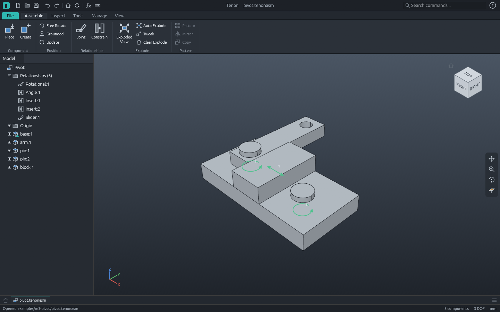
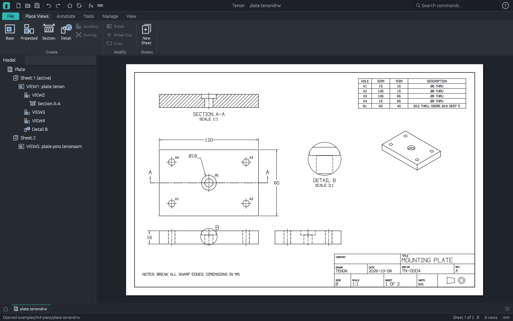
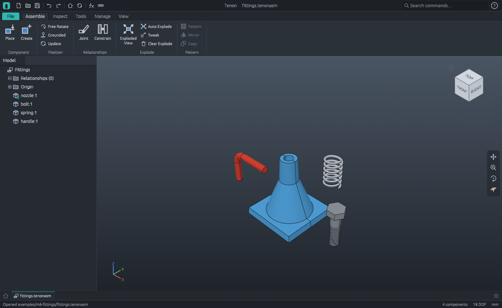

# Tenon

Tenon is a free, open-source, cross-platform parametric 3D CAD application written in Rust. The
workflow is the familiar one for mechanical design: sketch, constrain, build features, assemble,
then document in drawings.

**Status: milestones M0 to M6 are done; M7 (standard parts and the maker workflow) is next.**
CI runs on Linux, macOS and Windows.

Tenon is for makers, students and small shops. It aims to win on reliability, coherence and speed
rather than feature count.

In parts, you can:

- sketch on a plane, a face of the part or a work plane (lines, arcs, circles, rectangles,
  polygons, splines), with typed values, inference, live solving and a degrees-of-freedom readout;
- extrude (straight or tapered) and revolve to add, cut or intersect, with a live preview;
- sweep a profile along a path, loft through sections, wind coils;
- fillet, chamfer and shell; drill simple, counterbored and countersunk holes; add ribs;
- thread shafts and holes (cosmetic, or cut into the part), draft faces, split and combine
  solids;
- copy features in rectangular and circular patterns, and mirror them;
- place work planes, axes and points;
- drive any dimension or feature value by an equation of named parameters (fx);
- keep one part in several sizes with a design table, and use it in an assembly in any of them;
- give the part a material and a colour, and read its mass, volume and centre of gravity;
- roll the part back with the End of Part marker, reorder and suppress features;
- measure areas, lengths, distances and angles;
- edit any feature later: faces and edges you referred to are found again after upstream edits;
- save `.tenon` projects and export STEP and STL.

In assemblies (`.tenonasm` files that use your part files), you can:

- place components, ground them, and hold them together with mate, flush, angle and insert
  constraints or rigid, rotational, slider, cylindrical, planar and ball joints;
- drag components (their relationships hold) and see the degrees of freedom each has left;
- check interference, list the parts with their materials and masses (and export the list as
  CSV), weigh the assembly, explode it;
- double-click a component to edit its part in place, with the rest of the assembly in view.

In drawings (`.tenondrw` files that show your parts and assemblies), you can:

- place base, projected, isometric, section and detail views on ANSI or ISO sheets, with hidden
  lines removed and centrelines drawn;
- dimension by clicking edges; the dimensions follow the model when it changes;
- add hole tables, parts lists from the bill of materials, balloons and text;
- open a view's model from the drawing, change it, and come back to an updated drawing;
- use your own title block templates;
- export PDF, SVG and DXF.

The workbench follows the familiar mechanical-CAD layout and workflow (ribbon, model browser,
properties panel, orientation cube, radial menu). The same commands drive scripts and an MCP
server for AI agents. What works, with the test that proves each item, is in
[ROADMAP.md](ROADMAP.md).







## Design

- **Kernel behind a trait.** All geometry goes through the backend-neutral `Kernel` trait
  (`crates/kernel`). The first backend binds [OpenCASCADE Technology](https://dev.opencascade.org)
  8 through a small C++ shim (`crates/kernel-occt`), the only crate allowed to use `unsafe`. A
  Rust-native kernel may replace it later, operation by operation, as an experimental track that
  the product does not wait for.
- **Persistent naming from day one.** Every kernel operation reports where faces and edges came
  from, so features can refer to geometry in a way that survives upstream edits
  ([docs/persistent-naming.md](docs/persistent-naming.md)).
- **Everything is a command.** Every change to a part is a named command with JSON parameters
  ([docs/commands.md](docs/commands.md)). The ribbon, command scripts
  ([docs/scripts.md](docs/scripts.md)) and the MCP server for AI agents
  ([docs/mcp.md](docs/mcp.md)) all use the same registry.
- **The UI thread never waits for geometry.** Regeneration runs on a worker thread; the viewport
  keeps drawing the last result.
- **Strict layering.** `cargo xtask layers` enforces the crate graph: nothing below `ui` knows
  about egui, nothing above `kernel` knows about OpenCASCADE.

See [docs/architecture.md](docs/architecture.md) and [docs/plan.md](docs/plan.md).

## Building

You need Rust (stable, 1.90 or later), a C++17 compiler (MSVC 2022 on Windows, Xcode command line
tools on macOS, gcc or clang on Linux) and [pixi](https://pixi.sh), which provides OpenCASCADE.
Step-by-step instructions per platform are in [docs/setup.md](docs/setup.md).

```sh
pixi install                       # once: OpenCASCADE 8 into .pixi/
pixi run app                       # the desktop app (release build)
pixi run app examples/m2-enclosure/enclosure.tenon
pixi run app examples/m3-pivot/pivot.tenonasm
pixi run app examples/m4-plate/plate.tenondrw
pixi run app examples/m6-fittings/fittings.tenonasm
pixi run cargo test --workspace    # build and test
pixi run ci                        # the full gate CI runs
pixi run cargo run -p tenon-cli -- run examples/m2-enclosure/enclosure.json --out out
pixi run cargo run -p tenon-cli -- render out/enclosure.tenon out/enclosure.png --view front
pixi run mcp                       # MCP server on stdio (docs/mcp.md)
```

`pixi run` puts the OpenCASCADE libraries on the library path, so start Tenon through it.

On Windows with Smart App Control enabled, freshly built binaries can be blocked; see
[docs/setup.md](docs/setup.md#smart-app-control).

## Origins

Tenon is a fork of [CADCraft](https://github.com/storytold/cadcraft) (MIT OR Apache-2.0) at
commit `14e143b`. It keeps CADCraft's 2D geometry, DXF reader/writer and workspace tooling, and
its sketch constraint solver was ported in M1. CADCraft's AutoCAD-style drafting stack and the
ArtCraft brand were removed. See [NOTICE](NOTICE).

## License

Tenon's own code is licensed under either of [Apache License 2.0](LICENSE-APACHE) or
[MIT license](LICENSE-MIT), at your option. OpenCASCADE Technology is a separate library under
LGPL-2.1 (with the Open CASCADE exception), linked dynamically; see [NOTICE](NOTICE) for how to
obtain its source and replace it.

## Trademarks

Tenon is an independent project. It is not affiliated with, sponsored by or endorsed by
Autodesk, Inc. or any other CAD vendor. Autodesk, Inventor and AutoCAD are registered trademarks
of Autodesk, Inc. All other trademarks are the property of their respective owners. Tenon does not
read or write any vendor's proprietary file formats; it uses open formats (STEP, STL, 3MF, DXF)
and its own documented project format.
