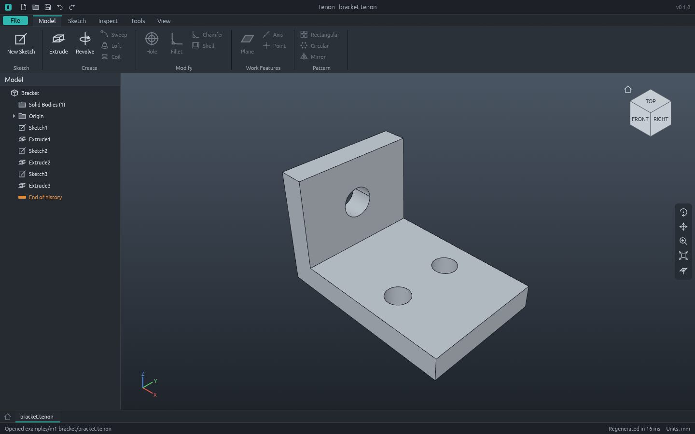

# M1 demo: parametric bracket with holes



The same L-bracket as the M0 demo, now built the M1 way: as a feature tree from sketches,
constraints and extrusions, driven by the command script [`bracket.json`](bracket.json).

1. **Sketch1** on the XZ plane: an L profile of six lines with 12 constraints (fix, horizontal,
   vertical, four lengths). The script checks that it is fully constrained (0 degrees of freedom).
2. **Extrusion1**: 40 mm. The script checks the volume, 28 800 mm³.
3. **Sketch2** on the base's top face, found by its persistent name ("the side face swept from the
   `base_top` line of Extrusion1"), with two 8 mm circles (a diameter and an equal constraint).
4. **Extrusion2**: cut through all.
5. **Sketch3** on the upright's inner face, with one 10 mm circle, and **Extrusion3**: cut through
   all.

The script then checks the result is one valid solid of 28 800 − 456π = 27 367.434 mm³, makes a
**parametric edit** (base thickness 8 → 10 mm), and checks the new volume, 33 600 − 520π mm³.
The hole sketch follows the moved top face; see `bracket-thick-base.png`. It then **undoes** the
edit, checks the original volume again, and saves and exports.

Regenerate (from the repository root):

```sh
pixi run cargo run -p tenon-cli -- run examples/m1-bracket/bracket.json --out examples/m1-bracket
pixi run cargo run -p tenon -- examples/m1-bracket/bracket.tenon
```

`tenon-cli demo m1 --out DIR` runs the same script. `apps/tenon-cli/tests/m1.rs` runs it in CI,
reads the STEP file back, reopens the project, and holds the performance budget
([docs/performance.md](../../docs/performance.md)).

| File | What |
|---|---|
| `bracket.json` | The command script ([docs/scripts.md](../../docs/scripts.md)) |
| `bracket.tenon` | The part as a Tenon project ([docs/file-format.md](../../docs/file-format.md)); open it in the app and edit any feature |
| `bracket.step` | STEP AP214, millimetres (the header holds a timestamp, so it changes on every run) |
| `bracket.stl` | Binary STL, millimetres |
| `bracket.png`, `bracket-thick-base.png` | Software renders before and after the thickness edit |
| `workbench.png` | `tenon examples/m1-bracket/bracket.tenon --screenshot workbench.png` |
