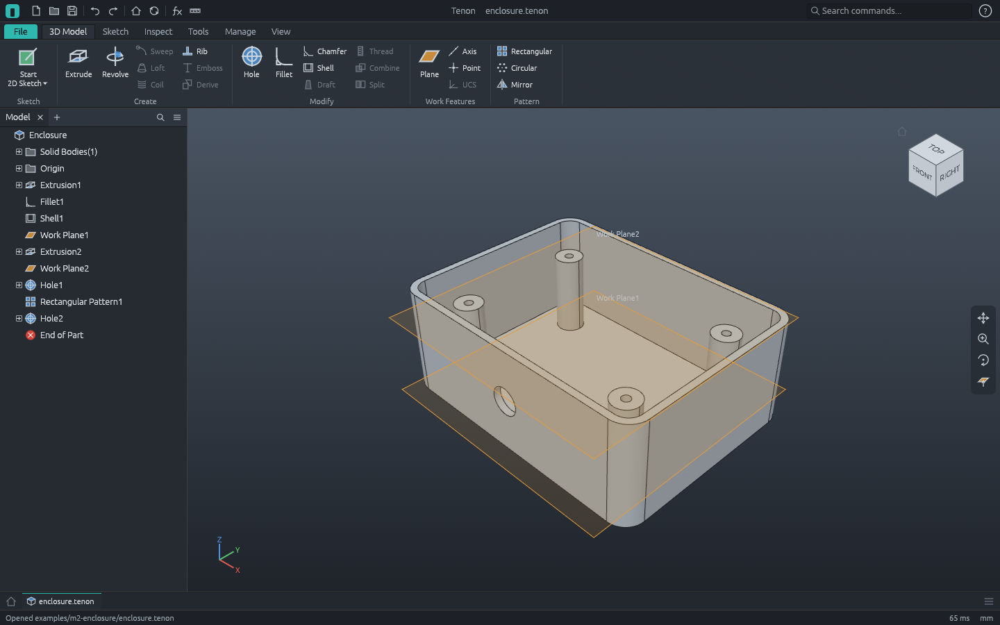

# M2 demo: parametric enclosure



A filleted, shelled box with four screw bosses and a cable hole, built from the command script
[`enclosure.json`](enclosure.json). Four user parameters (Parameters dialog, fx) drive every size:

| Parameter | Value | Drives |
|---|---|---|
| `L` | 80 mm | footprint length, boss spacing along X (`L - 24`), cable hole position (`L / 2`) |
| `W` | 60 mm | footprint width, boss spacing along Y (`W - 24`) |
| `H` | 30 mm | extrusion height, boss height (`H - 5 - t`), screw-hole plane (`H - 5`), cable hole height (`H / 2`) |
| `t` | 2 mm | shell thickness, floor work plane, cable hole depth |

After every feature the script checks the volume against its analytic value.

1. **Sketch1** on XY: an `L` x `W` rectangle with a corner on the origin, fully constrained.
   **Extrusion1**, `H`: 144 000 mm³.
2. **Fillet1** (r 6) on the four vertical edges, each named by the two sides it joins.
3. **Shell1**, `t` thick, with the top face removed.
4. **Work Plane1** `t` above XY (the inside floor) carries the boss sketch; **Extrusion2** grows a
   r 4 boss to `H - 5 - t`. **Work Plane2** at `H - 5` carries the point for **Hole1** (2.5 mm,
   10 deep, flat bottom).
5. **Rectangular Pattern1** copies the boss and its hole into the four corners, `L - 24` by
   `W - 24` apart.
6. **Hole2**: an 8 mm cable hole through the front wall, at (`L / 2`, `H / 2`) on XZ, `t` deep.
   28 617.03 mm³, one valid solid.
7. **`L` = 100, `H` = 40**: the box, its fillets and shell, the boss spacing and heights and the
   cable hole all follow (41 335.97 mm³, see `enclosure-larger.png`). Undo returns to the first
   size, then the script saves and exports.

Regenerate (from the repository root):

```sh
pixi run cargo run -p tenon-cli -- run examples/m2-enclosure/enclosure.json --out examples/m2-enclosure
pixi run cargo run -p tenon -- examples/m2-enclosure/enclosure.tenon
```

`tenon-cli demo m2 --out DIR` runs the same script. `apps/tenon-cli/tests/m2.rs` runs it in CI,
reads the STEP file back, reopens the project and changes `W`.

| File | What |
|---|---|
| `enclosure.json` | The command script ([docs/scripts.md](../../docs/scripts.md)) |
| `enclosure.tenon` | The part as a Tenon project, with its parameters; open it and change `L`, `W`, `H` or `t` |
| `enclosure.step` | STEP AP214, millimetres (the header holds a timestamp, so it changes on every run) |
| `enclosure.stl` | Binary STL, millimetres |
| `enclosure.png`, `enclosure-larger.png` | Software renders at 80 x 60 x 30 and 100 x 60 x 40 |
| `workbench.png` | `tenon examples/m2-enclosure/enclosure.tenon --screenshot examples/m2-enclosure/workbench.png` |

A second M2 example, an L-mount with a rib, counterbored holes, a chamfer and End of Part, is in
[`../m2-mount`](../m2-mount).
