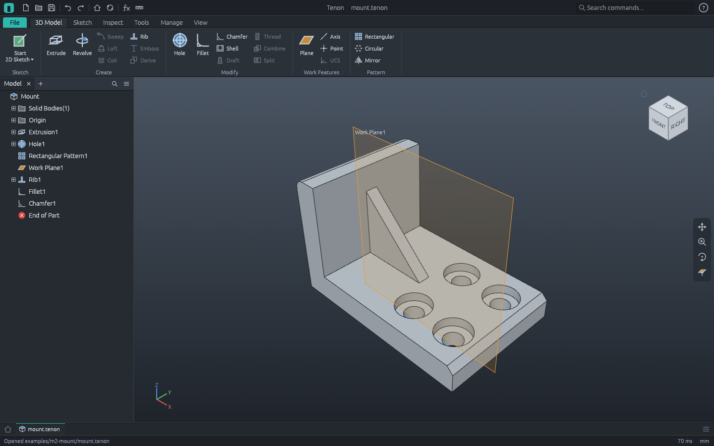

# M2 demo: parametric L-mount



An L-mount built with the M2 features and driven by one user parameter, from the command script
[`mount.json`](mount.json). After every feature the script checks the volume against its
analytic value.

1. **Sketch1** on XZ: the L profile, fully constrained (0 degrees of freedom). Its thickness
   dimension is driven by the user parameter **`t` = 8 mm** (Parameters dialog, fx).
2. **Extrusion1**, 40 mm: 28 800 mm³.
3. **Hole1**: two counterbored holes (6 mm, counterbore 11 × 3 mm) through the base, at points of
   a sketch on its top face. **Rectangular Pattern1** copies them 15 mm along X: four holes,
   28 800 − 543π mm³.
4. **Work Plane1**, 20 mm from XZ (halfway along), carries a sketch with one diagonal line.
   **Rib1** grows from it to the corner ("to next"); its thickness is the equation **`t / 2`**:
   + 968 mm³.
5. **Fillet1** (r 3) on the upright's top back edge and **Chamfer1** (2 mm) on the toe's top
   edge, both edges named by the two faces they join: 29 328 − 453π mm³, one valid solid.
6. **Measure**: bottom face to the top of the upright, 38 mm.
7. **End of Part** above Fillet1: the fillet and chamfer roll back (and come back).
8. **`t` = 10**: the base thickens, the counterbored holes go deeper, the rib becomes 5 thick and
   meets the higher base, the upright rises (the measurement reads 40): 34 160 − 525π mm³.
   See `mount-thick.png`. Undo returns to `t` = 8, then the script saves and exports.

Regenerate (from the repository root):

```sh
pixi run cargo run -p tenon-cli -- run examples/m2-mount/mount.json --out examples/m2-mount
pixi run cargo run -p tenon -- examples/m2-mount/mount.tenon
```

`tenon-cli demo m2-mount --out DIR` runs the same script. `apps/tenon-cli/tests/m2.rs` runs it in CI,
reads the STEP file back, reopens the project and changes `t` again.

| File | What |
|---|---|
| `mount.json` | The command script ([docs/scripts.md](../../docs/scripts.md)) |
| `mount.tenon` | The part as a Tenon project, with its parameters; open it and edit any feature or `t` |
| `mount.step` | STEP AP214, millimetres (the header holds a timestamp, so it changes on every run) |
| `mount.stl` | Binary STL, millimetres |
| `mount.png`, `mount-thick.png` | Software renders at `t` = 8 and `t` = 10 |
| `workbench.png` | `tenon examples/m2-mount/mount.tenon --screenshot examples/m2-mount/workbench.png` |
