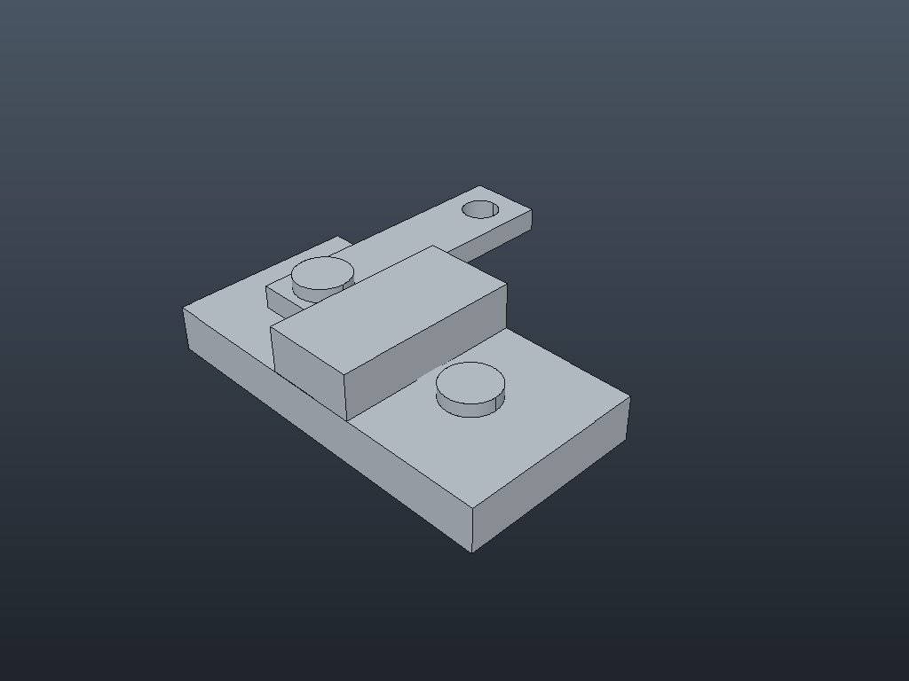
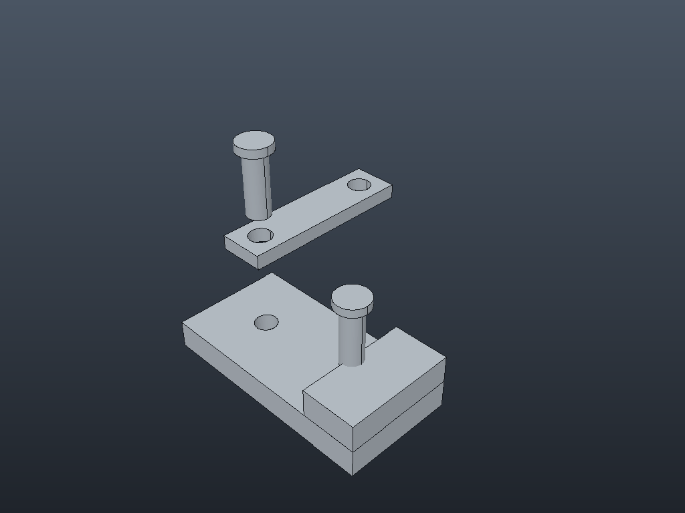

# M3 demo: pivot assembly



Four part files and an assembly that places them, all built by the command script
[`pivot.json`](pivot.json). The script checks every placement, the degrees of freedom, the
parts list, the volume and interference along the way.

**Parts:**

| Part | File | What |
|---|---|---|
| Base | `base.tenon` | 80 x 40 x 10 plate with two 8 mm holes |
| Arm | `arm.tenon` | 60 x 16 link with a hole at each end; its thickness is the user parameter `t` |
| Pin | `pin.tenon` | 8 mm shaft with a 12 x 3 head, used twice |
| Block | `block.tenon` | 20 x 40 x 10 |

**Assembly (`pivot.tenonasm`):**

1. **base:1** is placed first, so it is grounded at the origin.
2. **Rotational:1** joins the arm's first hole to the base's first hole. The arm can turn
   about the pin axis: 1 degree of freedom.
3. **Angle:1** sets the arm's front face at 90 degrees to the base's front face, so the arm
   points along +Y. It is fully placed: origin (28, 12, 10).
4. **Insert:1** puts a pin through the arm, its head on the arm. **Insert:2** puts a second pin
   in the base's other hole. Each pin can still turn about its axis.
5. **Slider:1** runs the block's bottom front edge along the base's top front edge. Placed at
   x = 50, the block covers the second pin's head: interference finds one clash of 108π mm³.
   Dragging it 20 left (and up and back, which the slider ignores) clears it.
6. **Parts list:** Base, Arm, Pin x 2, Block. Total volume 44 800 + 440π mm³.
7. **Auto Explode** (spacing 30) moves the arm and its pin up, then the pin again, and the
   other pin up. See `pivot-exploded.png`.
8. **The arm edited in place:** `t` = 8. The pin on it rises 3 mm, and saving the assembly
   saves `arm.tenon` too. The reopened assembly reads the new arm: 47 680 + 344π mm³.



Regenerate (from the repository root):

```sh
pixi run cargo run -p tenon-cli -- run examples/m3-pivot/pivot.json --out examples/m3-pivot
```

`tenon-cli demo m3 --out DIR` runs the same script. `apps/tenon-cli/tests/m3.rs` runs it in CI.
It also checks:

- the STEP file reads back with the same volume;
- the parts list (CSV);
- the assembly reopens from another folder, and reports a missing part file;
- undo, a refused conflict, dragging, suppressing and editing a relationship.

| File | What |
|---|---|
| `pivot.json` | The command script ([docs/scripts.md](../../docs/scripts.md)) |
| `base.tenon`, `arm.tenon`, `pin.tenon`, `block.tenon` | The parts (the arm with `t` = 8, as edited in place) |
| `pivot.tenonasm` | The assembly; part paths are stored relative to it |
| `pivot.step` | Every component's solid where it is placed (STEP AP214, mm; the header holds a timestamp) |
| `pivot-bom.csv` | The parts list |
| `pivot.png`, `pivot-exploded.png` | Software renders, assembled and exploded |
