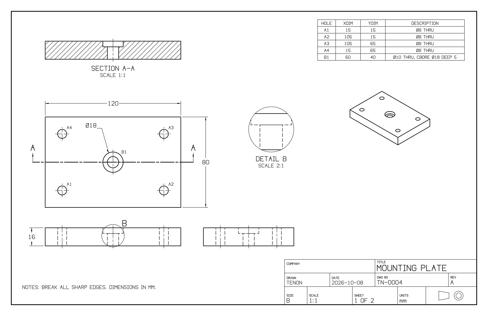
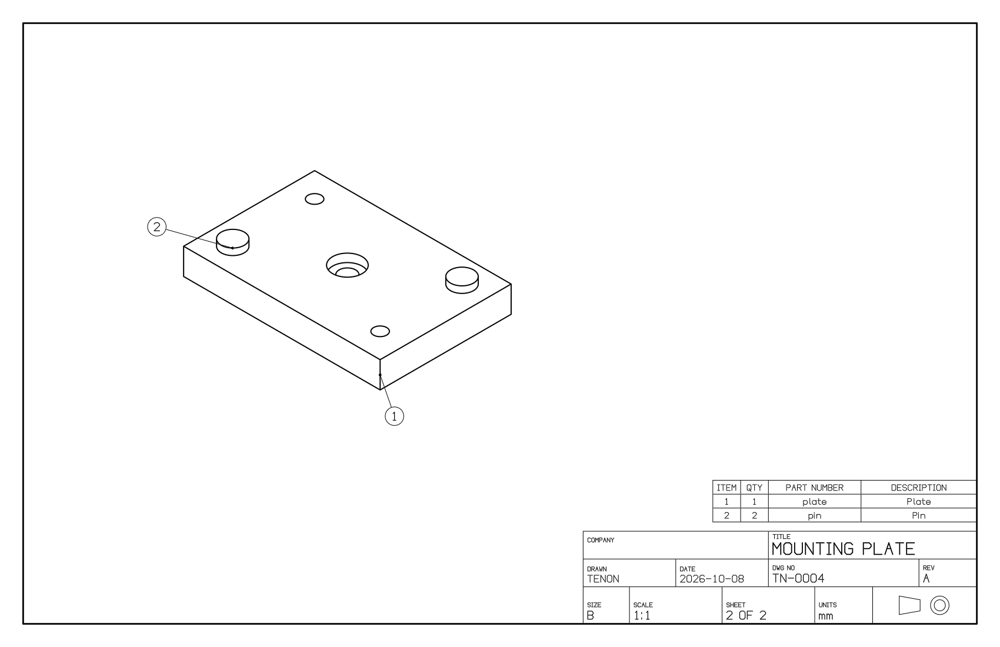

# M4 demo: drawing of a plate and its assembly


A plate, a pin, an assembly of them and a two-sheet drawing, all built by the command script
[`plate.json`](plate.json). The script checks every view, every dimension's value and the hole
table along the way. Then it makes the plate thicker and checks that the drawing follows.

**Models:**

| Model | File | What |
|---|---|---|
| Plate | `plate.tenon` | 120 x 80, `t` thick (a user parameter, 12, then 16), four 8 mm holes through and a 10 mm hole counterbored 18 across and 5 deep |
| Pin | `pin.tenon` | 8 mm shaft with a 14 x 4 head |
| Plate assembly | `plate-pins.tenonasm` | the plate and the pin twice, in two of its holes |

**Drawing (`plate.tenondrw`, ANSI, third-angle, B size):**

1. **Sheet 1, the plate.** A front view at 1:1, with views projected from it: the top view
   above, the right view beside it, and an isometric view at 1:2.
2. **Section A-A** along the middle of the top view, through the counterbore, hatched.
3. **Detail B** of the counterbore in the front view, at 2:1.
4. **Dimensions** picked from the drawn edges, as a click picks them: the width (120) and depth
   (80) in the top view, the counterbore's diameter (Ø18), the thickness in the front view.
5. **Hole table:** A1 to A4 (Ø8 THRU) and B1 (Ø10 THRU, CBORE Ø18 DEEP 5), measured from the
   top view's bottom-left corner. Centre marks and centrelines are drawn automatically.
6. **The plate made thicker:** `t` = 16, saved, then `drw.update`. The views change, and the
   thickness dimension now reads 16. The other values stay as they are.
7. **Sheet 2, the assembly.** An isometric view, with a parts list from its bill of materials
   (plate x 1, pin x 2) and a balloon for each part.
8. **Exports:** a two-page PDF, and SVG and DXF of sheet 1. The reopened drawing makes its views
   again from the model files.




Regenerate (from the repository root), and open it:

```sh
pixi run cargo run -p tenon-cli -- run examples/m4-plate/plate.json --out examples/m4-plate
pixi run cargo run -p tenon -- examples/m4-plate/plate.tenondrw
```

In the workbench:

- drag a view: the views projected from it follow;
- press D, click an edge or two, then click where the dimension goes;
- select a view and use Open Model (right-click) to edit the plate, then Return: the drawing follows;
- export from the File menu.

`tenon-cli demo m4 --out DIR` runs the same script. `apps/tenon-cli/tests/m4.rs` runs it in CI.
It also checks:

- the PDF's pages and the SVG's text;
- the DXF read back: a layer per line type, and the top view's back edge where it belongs;
- the drawing reopens from another folder, and still opens and exports with its model files missing;
- undo, deleting a view with what was made from it, and refused input.

| File | What |
|---|---|
| `plate.json` | The command script ([docs/scripts.md](../../docs/scripts.md)) |
| `plate.tenon`, `pin.tenon` | The parts (the plate with `t` = 16) |
| `plate-pins.tenonasm` | The assembly; part paths are stored relative to it |
| `plate.tenondrw` | The drawing; model paths are stored relative to it |
| `plate.pdf` | Both sheets (with `t` = 16) |
| `plate.svg`, `plate.dxf` | Sheet 1 as first drawn (`t` = 12) |
| `plate-sheet1.png`, `plate-sheet2.png` | The sheets drawn by `render.png` |
| `workbench.png` | `tenon examples/m4-plate/plate.tenondrw --screenshot examples/m4-plate/workbench.png` |
