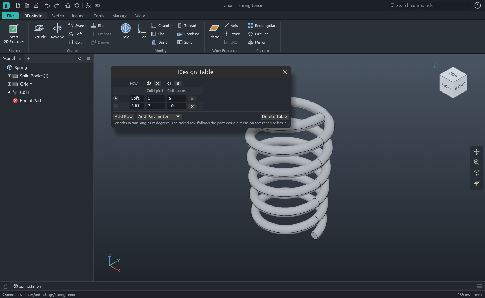
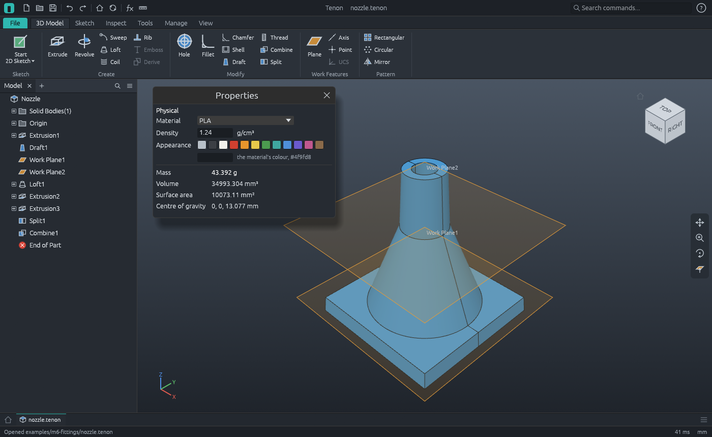

# M6 demo: four fittings


Four parts that between them use every M6 feature, built by the command script
[`fittings.json`](fittings.json). After every feature the script checks the volume or the mass
against its analytic value.

**Parts:**

| Part | File | Features | Material |
|---|---|---|---|
| Spring | `spring.tenon` | Coil; a design table with two sizes | Stainless steel |
| Bolt | `bolt.tenon` | Thread (cosmetic, then cut); a design table with two lengths | Steel, mild |
| Handle | `handle.tenon` | Sweep along a bent path | ABS, shown in a red of its own |
| Nozzle | `nozzle.tenon` | Draft, Loft, tapered Extrude, Split, Combine | PLA |

**Spring.** A 2 mm circle 8 mm from the Z axis, wound 6 turns at a pitch of 5 mm
(**Coil1**). Each turn is the wire's area times the way its centre goes round the axis:
16π² mm³, so 947.48 mm³ in all and 7.58 g in stainless steel. The **design table** holds the
coil's pitch and turns: *Soft* (5 mm, 6 turns) is the part as it was drawn, *Stiff* (3 mm, 10
turns) is 1579.14 mm³. See `spring.png` and `spring-stiff.png`.



**Bolt.** A hexagonal head 15 mm across its corners and 5.3 mm high on an 8 × 30 mm shank:
2282.52 mm³. **Thread1** is first cosmetic, 20 mm long from the free end: Tenon sizes it from
the shank (M8x1.25, ISO coarse) and the solid is as it was. Then the same thread is modelled:
sixteen turns of the basic 60 degree profile are cut into the shank, 11.13 mm³ a turn, which
leaves about 2104 mm³ (16.5 g in mild steel). The design table has two lengths, *M8x30* and
*M8x50*; the longer shank keeps its 20 mm of thread.

**Handle.** A 6 mm circle swept along a path drawn in another sketch (**Sweep1**): up 20 mm,
round a bend of 10 mm radius, along 30 mm. Its volume is the circle's area times the path's
length, 9π (50 + 5π) = 1857.85 mm³. The material is ABS; the part has an appearance of its own,
`#d04030`.

**Nozzle.**

1. **Extrusion1**: a 50 × 50 × 6 mm flange. **Draft1** tilts its four sides 5 degrees about the
   XY plane, so the top is 50 − 12 tan 5° wide: 14 687.25 mm³.
2. **Loft1** from a 40 mm circle on the flange to a 16 mm circle 30 mm higher, each on a work
   plane: + 6240π mm³.
3. **Extrusion2**: the spout, a 16 mm circle extruded 20 mm with a taper of 3 degrees.
4. **Extrusion3**: an 8 mm bore through everything: − 896π mm³. 34 993.30 mm³ in all.
5. **Split1** along the XZ plane, keeping one half, shows the inside (`nozzle-section.png`).
   The script takes that back, splits again keeping both halves (two solids of half the volume
   each), and **Combine1** joins them into one solid of the same volume.
6. In PLA it weighs 43.39 g.



**Assembly (`fittings.tenonasm`).** The four parts side by side. The parts list
(`fittings-bom.csv`) names each part's material and what one of it weighs; `asm.mass` weighs
the assembly with each part at its own density: 69.4 g.

Regenerate (from the repository root):

```sh
pixi run cargo run -p tenon-cli -- run examples/m6-fittings/fittings.json --out examples/m6-fittings
pixi run cargo run -p tenon -- examples/m6-fittings/fittings.tenonasm
```

`tenon-cli demo m6 --out DIR` runs the same script. `apps/tenon-cli/tests/m6.rs` runs it in CI,
reads the nozzle's STEP file back, reopens the parts and checks that the project files here are
what the script writes.

| File | What |
|---|---|
| `fittings.json` | The command script ([docs/scripts.md](../../docs/scripts.md)) |
| `spring.tenon`, `bolt.tenon`, `handle.tenon`, `nozzle.tenon` | The parts, with their materials and design tables |
| `fittings.tenonasm` | The assembly |
| `fittings-bom.csv` | The parts list, with materials and masses |
| `nozzle.step`, `nozzle.stl` | The nozzle as STEP AP214 (its header holds a timestamp, so it changes on every run) and binary STL, millimetres |
| `spring.png`, `spring-stiff.png`, `bolt.png`, `handle.png`, `nozzle.png`, `nozzle-section.png`, `fittings.png` | Software renders |
| `workbench.png` | `tenon examples/m6-fittings/fittings.tenonasm --screenshot examples/m6-fittings/workbench.png` |
| `properties.png` | `tenon examples/m6-fittings/nozzle.tenon --run inspect.mass --screenshot examples/m6-fittings/properties.png` |
| `design-table.png` | `tenon examples/m6-fittings/spring.tenon --run tools.table --screenshot examples/m6-fittings/design-table.png` |
